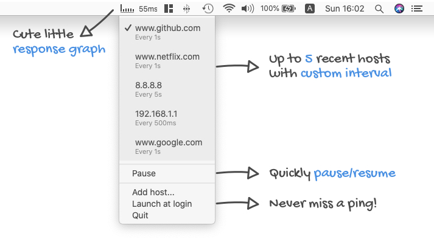

## Pingu
🐧 A nifty menubar app that... pings

[Download latest release](https://github.com/attheodo/Pingu/releases/download/v1.0.0/Pingu.1.0.0.dmg)

### Features

✅ Utilizes `BSD Ping` of your macOS system under the hood

🌒 Supports light and dark mode

🎯 Easily switch between your last 5 hosts (LIFO)

🕐 Custom interval for each ping targer (500ms, 1s, 5s, 30s and 1m)

🚀 Launch at login for the lazy ones

### Room for improvement
- Assumes `BSD ping` utility resides at `/sbin/ping` (default path for macOS). If it's not there, well, it won't work. In fact it might crash, I didn't check.
- Parsing `BSD ping`'s output is to say the least... naive. Regex would be a good next improvement if not rolling an entirely homebrew ICMP infra.
- Needs an auto-update mechanism. [Sparkle](https://github.com/sparkle-project/Sparkle) has been evaluated as good candidate.

### Contributing & Feedback
- Contributions are welcome. Feel free to open a PR.
- For feedback, bug reports or showing love, please open an issue.

